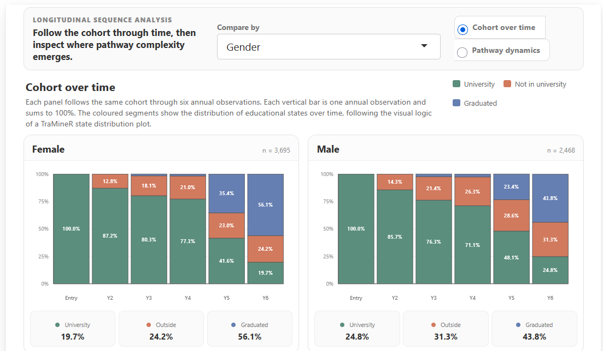
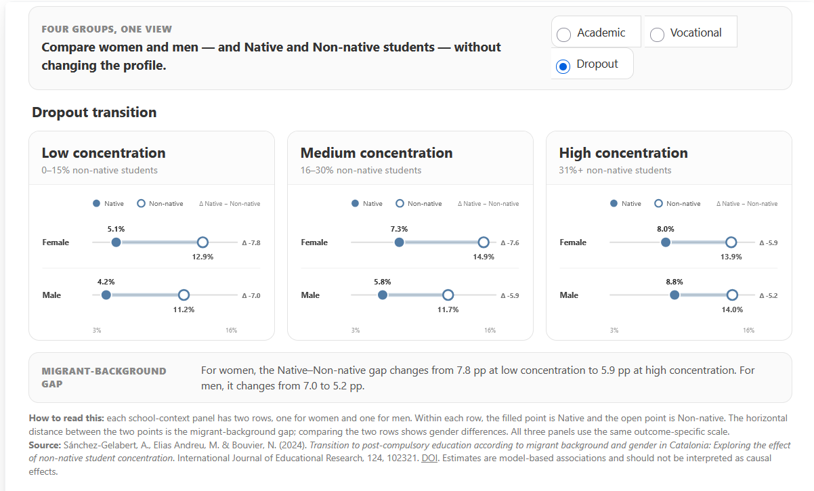
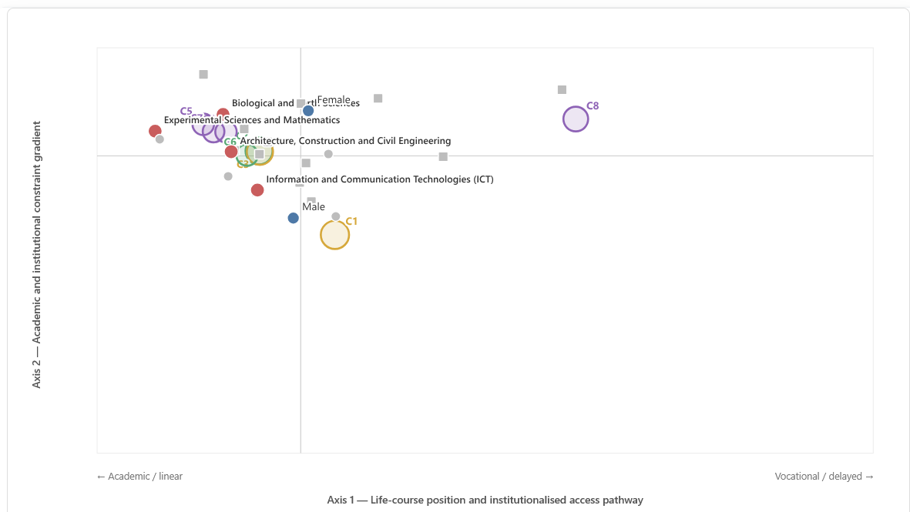
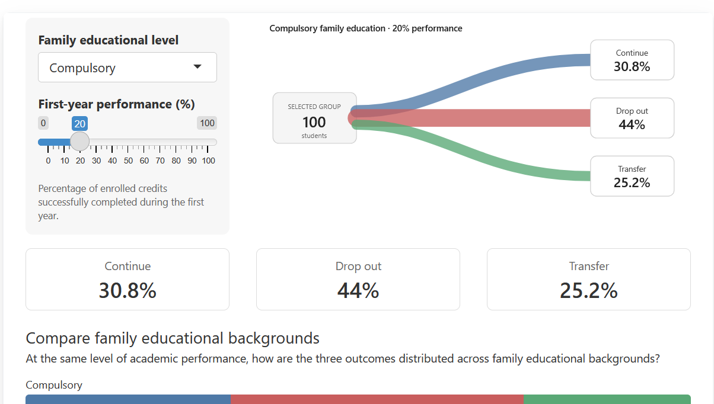
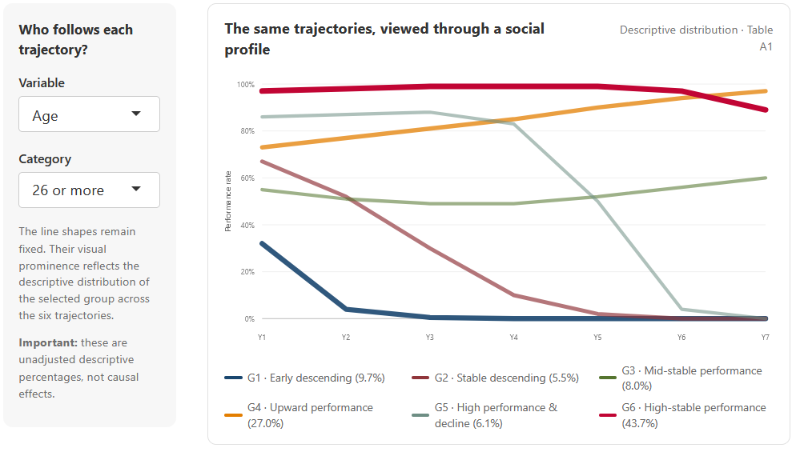

### [Longitudinal Pathway Dynamics](pathways/)

Follow how a university cohort evolves across six annual observations and compare longitudinal pathway dynamics across student profiles.

Sequence analysis · TraMineR · longitudinal trajectories

[Open explorer →](pathways/){.tool-link}

### [School Context & Transition Explorer](context/)

Compare academic, vocational and dropout transitions across different school-composition contexts, examining gender and migrant-background inequalities at a glance.

Predicted probabilities · gender × migrant background × school composition

[Open explorer →](context/){.tool-link}

### [University Entry Space Explorer](entry-space/)

Navigate the multidimensional space of university entry and examine how student characteristics, entry profiles and degree subfields are positioned within it.

Multiple Correspondence Analysis · profiles · degree subfields

[Open explorer →](entry-space/){.tool-link}

### [Compensatory Advantage Explorer](compensatory/)

Explore how first-year academic performance and family educational background are associated with the probability of continuing, transferring or dropping out of university.

Predicted probabilities · social background × academic performance

[Open explorer →](compensatory/){.tool-link}

### [University Trajectory Lab](trajectories/)

Explore six patterns of academic progression over seven years, who is more often found in each trajectory, and how adjusted probabilities differ across fields of study.

Group-Based Trajectory Modelling · longitudinal progression

[Open lab →](trajectories/){.tool-link}

These tools are based on published studies and research outputs. Where model-based estimates are shown, they should be interpreted as associations rather than causal effects.

